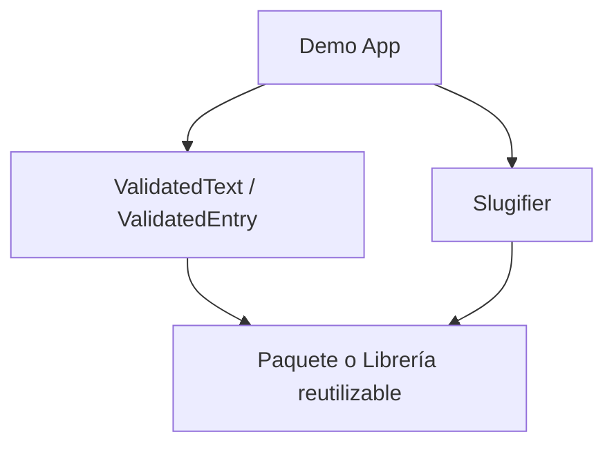

# 204 - Componentes y Librerías Reutilizables

## Materia

Tópicos Avanzados de Programación - 4SA

## Equipo

Los tres mosqueteros

## Integrantes

- García Kumul Francisco Gonzalo
- Che Fernández Freddy Armando
- Un Uicab Edwin Geovanni

## Docente

Espinosa Atoche José Antonio

---

# Objetivo

El objetivo de esta actividad es diferenciar los conceptos de
**componente, paquete y librería**, así como desarrollar componentes
reutilizables mediante Java/JavaFX y Python/Tkinter.

Se implementaron:

- Un componente visual para validación de texto.
- Un componente no visual para generación de slugs.
- Aplicaciones de demostración.
- Un paquete Python reutilizable.
- Una librería Java empaquetada como JAR.

---

# Diferencia entre componente, paquete y librería

## Componente

Un componente es una parte del software diseñada para realizar una
función específica y poder utilizarse dentro de diferentes aplicaciones.

En esta actividad se desarrollaron:

- `ValidatedTextField` en JavaFX.
- `ValidatedEntry` en Python/Tkinter.
- `Slugifier` como componente no visual.

## Paquete

Un paquete permite organizar clases o módulos relacionados dentro de una
misma estructura.

Ejemplos utilizados:

### Java

```text
lib
├── ValidatedTextField.java
└── Slugifier.java
```

### Python

```text
guiutils
├── __init__.py
├── validated_entry.py
└── slugifier.py
```

## Librería

Una librería es un conjunto de componentes que pueden ser incorporados y
reutilizados desde otros proyectos.

En Java se genera:

```text
reusablesfx-1.0.0.jar
```

En Python se creó el paquete:

```text
guiutils
```

que puede instalarse localmente mediante `pip`.

---

# Componente visual

## ValidatedText / ValidatedEntry

El componente visual desarrollado consiste en un campo de texto capaz de
validar automáticamente el contenido introducido por el usuario.

En la demostración se utiliza para validar una dirección de correo
electrónico.

Ejemplo de correo válido:

```text
usuario@gmail.com
```

Resultado:

```text
Estado: VÁLIDO
```

Ejemplo de correo inválido:

```text
usuario
```

Resultado:

```text
Estado: INVÁLIDO
```

El componente cambia visualmente dependiendo del resultado de la
validación.

---

# Componente no visual

## Slugifier

`Slugifier` es un componente que convierte una cadena de texto en un
formato adecuado para utilizarse como slug.

Ejemplo:

```text
Hola Mundo
```

se convierte en:

```text
hola-mundo
```

Otro ejemplo:

```text
Programación Avanzada
```

se convierte en:

```text
programacion-avanzada
```

El componente:

- Convierte el texto a minúsculas.
- Elimina acentos.
- Elimina símbolos innecesarios.
- Sustituye espacios por guiones.
- Elimina guiones repetidos.

---

# Python / Tkinter

La implementación de Python se encuentra en:

```text
python/guiutils
```

## Estructura

```text
python/guiutils
│
├── guiutils
│   ├── __init__.py
│   ├── slugifier.py
│   └── validated_entry.py
│
├── tests
│   └── test_slugifier.py
│
├── demo.py
└── pyproject.toml
```

## Ejecutar la aplicación

Entrar en:

```powershell
cd "C:\Users\fcoza\Downloads\204\python\guiutils"
```

Ejecutar:

```powershell
py demo.py
```

---

# Instalar el paquete Python

El paquete puede instalarse de manera local y editable con:

```powershell
py -m pip install -e .
```

Esto permite utilizar `guiutils` desde otros programas Python.

Ejemplo:

```python
from guiutils import slug

print(slug("Hola Mundo"))
```

Resultado:

```text
hola-mundo
```

---

# Pruebas unitarias

El componente `Slugifier` cuenta con pruebas unitarias.

Para ejecutarlas:

```powershell
cd "C:\Users\fcoza\Downloads\204\python\guiutils"

py -m unittest discover tests
```

Resultado obtenido:

```text
.....
----------------------------------------------------------------------
Ran 5 tests

OK
```

Las pruebas comprueban:

- Conversión básica.
- Eliminación de acentos.
- Eliminación de símbolos.
- Manejo de espacios múltiples.
- Eliminación de guiones repetidos.

---

# Java / JavaFX

La implementación Java se encuentra en:

```text
java/reusablesfx
```

## Estructura

```text
java/reusablesfx
│
├── pom.xml
│
└── src
    └── main
        ├── java
        │   ├── demo
        │   │   └── DemoApp.java
        │   │
        │   └── lib
        │       ├── Slugifier.java
        │       └── ValidatedTextField.java
        │
        └── resources
            └── style.css
```

---

# Compilar Java

Entrar al proyecto:

```powershell
cd "C:\Users\fcoza\Downloads\204\java\reusablesfx"
```

Compilar:

```powershell
mvn clean compile
```

---

# Ejecutar la aplicación JavaFX

```powershell
mvn javafx:run
```

La aplicación utiliza los dos componentes desarrollados:

- `ValidatedTextField`
- `Slugifier`

---

# Crear el JAR

Para empaquetar la librería:

```powershell
mvn clean package
```

El archivo generado se encuentra en:

```text
target/reusablesfx-1.0.0.jar
```

---

# Instalar el JAR localmente

La librería también puede instalarse en el repositorio Maven local:

```powershell
mvn install
```

Después puede utilizarse desde otro proyecto Maven mediante:

```xml
<dependency>
    <groupId>mx.itmerida</groupId>
    <artifactId>reusablesfx</artifactId>
    <version>1.0.0</version>
</dependency>
```

---

# Diagrama de dependencias



La aplicación de demostración utiliza los dos componentes desarrollados.
Estos componentes forman parte de un paquete o librería que puede ser
reutilizado desde otros proyectos.

---

# Estructura general del repositorio

```text
204
│
├── java
│   └── reusablesfx
│       ├── pom.xml
│       └── src
│           └── main
│               ├── java
│               │   ├── demo
│               │   │   └── DemoApp.java
│               │   └── lib
│               │       ├── Slugifier.java
│               │       └── ValidatedTextField.java
│               └── resources
│                   └── style.css
│
├── python
│   └── guiutils
│       ├── guiutils
│       │   ├── __init__.py
│       │   ├── slugifier.py
│       │   └── validated_entry.py
│       ├── tests
│       │   └── test_slugifier.py
│       ├── demo.py
│       └── pyproject.toml
│
├── .gitignore
└── README.md
```

---

# Tecnologías utilizadas

- Java
- JavaFX
- Maven
- Python
- Tkinter
- unittest
- Git
- GitHub

---

# Conclusión

La actividad permitió comprender la diferencia entre un componente, un
paquete y una librería.

Los componentes visuales permiten crear elementos reutilizables que
interactúan directamente con el usuario, mientras que los componentes no
visuales proporcionan funciones que pueden utilizarse internamente desde
diferentes programas.

Mediante Python se creó un paquete local reutilizable, mientras que en
Java se utilizó Maven para generar una librería en formato JAR.

De esta manera, los mismos componentes pueden utilizarse desde distintas
aplicaciones sin necesidad de volver a desarrollar su funcionalidad.
